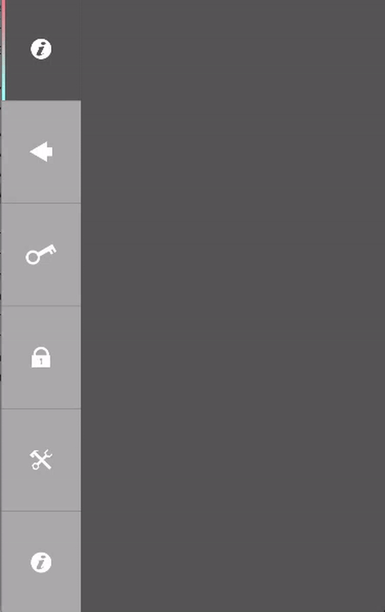

# GCToolBar
A flexible toolbar with optional selection indicator



# Introduction
GCToolBar was created for my own usage in my apps. I needed a flexible toolbar that can also
doubles as a tabbar with stylish indicator. And I also need it to be implemented at any position -
bottom, top, and even vertically on right or left side.

# Usage
Easy to use. 

1. Drag GCToolBar.m and .h to your Project in XCode.
2. Add a placeholder UIView in your storyboard where you want the bar to appear. Add
the constraints accordingly. Connect IBOutlet of this view into your header file.
3. `#import "GCToolBar.h"` in your header file.
4. Implement the `GCToolBarDelegate`.
5. In `viewDidLoad` of your viewController, add the following code to create the toolbar:
```obj-c
    // define the colors
    NSArray *colors = @[[UIColor grayColor],//GC_BUTTON_COLOR,
                        [UIColor lightGrayColor],//GC_BUTTON_BORDER_COLOR,
                        [UIColor cyanColor],//GC_BUTTON_INDICATOR,
                        [UIColor cyanColor],//GC_BUTTON_INDICATOR2,
                        [UIColor darkGrayColor],//GC_BUTTON_COLOR_HIGHLIGHT
                        ];
    
    // add buttons by adding btn icons. You can define colors separately to each button
    // if you want. Or simply apply same color scheme to all button.
    NSArray *toolbarItems = [NSArray arrayWithObjects:
                             [GCToolBar btnWithImgName:@"btn1" andColors:colors],
                             [GCToolBar btnWithImgName:@"btn2" andColors:colors],
                             [GCToolBar btnWithImgName:@"btn3" andColors:colors],
                             [GCToolBar btnWithImgName:@"btn4" andColors:colors],
                             [GCToolBar btnWithImgName:@"btn5" andColors:colors],
                             nil];
    
    // ToolBar constructor using the placeholder view to position
    GCToolBar *normalBar = [[GCToolBar alloc] initWithFrame:_barPlaceHolder.frame 
    						andItems:toolbarItems 
    						indicatorPos:GC_INDICATOR_BOTTOM];
    normalBar.delegate = self;
    
    // This to specify that you want selectable type.
    normalBar.selectable = YES;
    [self.view addSubview:normalBar];
    [normalBar selectButtonAtIndex:2]; // initial selection`
```
6. Implement delegate function:
```obj-c
    -(void)GCToolBarButton:(GCToolBar *)toolBar didClickedAtIndex:(NSInteger)index {
    
    }
```
7. Done!

